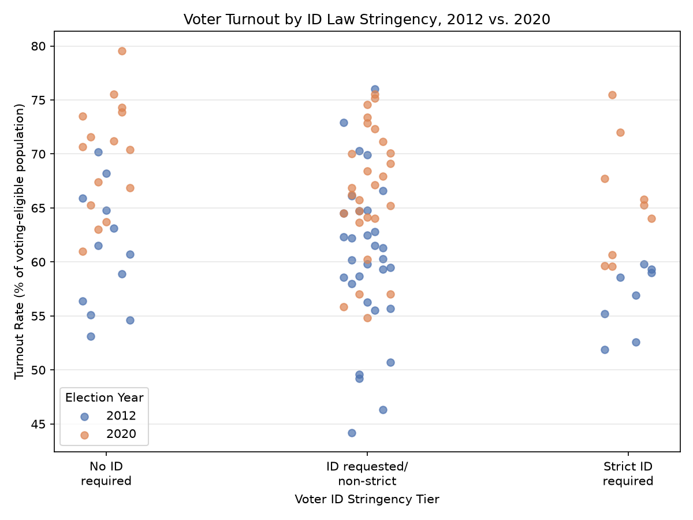
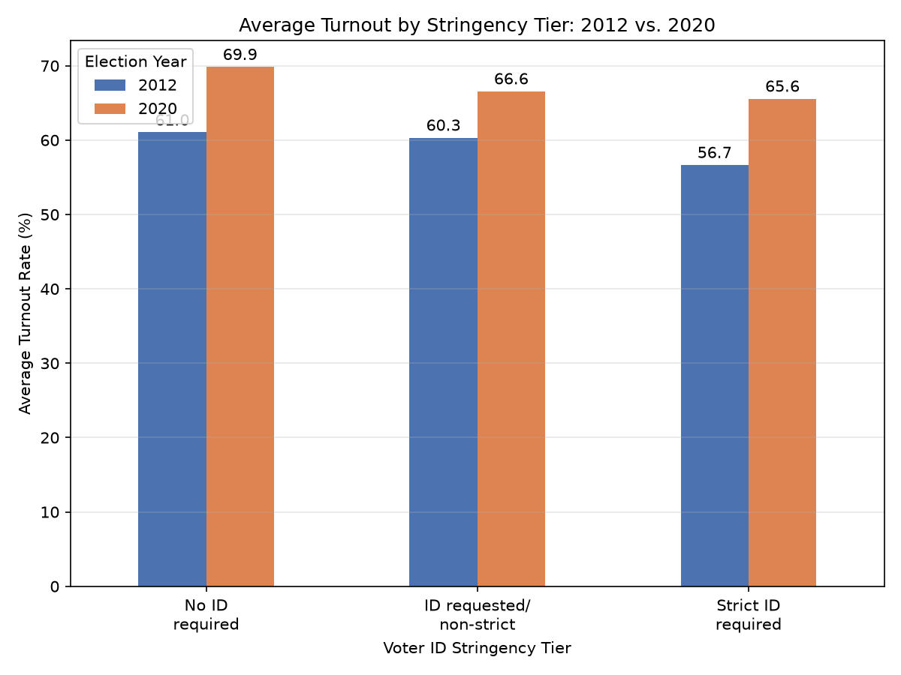

# Projects
This section documents my data science projects, research questions, and data stories I create throughout the semester.
---
[Project 1](#Project-1-Voter-ID-Laws-and-Voter-Turnout) · [Project 2](#project-2)
### Project 1 Voter ID Laws and Voter Turnout

**Jump to:** [Problem Definition](#1-problem-definition) · [Data Description](#2-data-description) · [Data Cleaning](#3-data-cleaning-and-preparation) · [Visualizations](#4-visualizations-and-insights) · [Storytelling](#5-storytelling-and-narrative) · [Limitations](#6-limitations-ethics-and-reflection) · [Code & Sources](#7-code-and-transparency)

### 1. Problem Definition

**Research question:** Is there a relationship between the stringency of a state's voter ID law and its voter turnout rate in U.S. presidential elections?

**Context:** Voter ID laws have been one of the most contested issues in American election administration over the past two decades. Advocates argue that ID requirements protect election integrity and public confidence in the vote, while critics argue that they create an additional barrier that disproportionately affects certain voters, mainly those who are lower-income, elderly, or lack easy access to the documentation needed. Since the Supreme Court's 2008 decision in Crawford v. Marion County Election Board upheld Indiana's photo ID law, more states have adopted or tightened ID requirements, making this a live and evolving area of election law. This project looks at two presidential election years — 2012 and 2020 — I chose this because they show a period of significant change in voter ID law (several major state laws were enacted, blocked by courts, or took effect for the first time during this window), and because national turnout rose between them.

**Why it matters:** This question sits at the intersection of my two majors. For political science, it's a live policy debate with real consequences for representation. For data science, it's a case study in how a social/legal variable that resists easy quantification (a state's "stringency") can still be operationalized and analyzed alongside more standard demographic data, while being honest about the limits of that operationalization.

### 2. Data Description

**Unit of analysis:** One row = one state (plus D.C.) in one presidential election year (2012 or 2020). 102 rows total.

**Key variables:**

| Variable | Conceptualization | Operationalization | Source |
|---|---|---|---|
| Voter ID stringency | How strict a state's ID requirement is | 3-tier ordinal scale: 0 = no ID required, 1 = ID requested but a voter without one can still cast a ballot that counts (affidavit/non-strict), 2 = strict requirement (provisional ballot + follow-up action required) | Hand-coded from Ballotpedia and NCSL reporting, cross-checked against known court rulings |
| Voter turnout rate | Share of eligible population that voted | Votes for president ÷ voting-eligible population (VEP), as a percentage | United States Elections Project (Dr. Michael McDonald), accessed via Ballotpedia's compiled tables |
| Median household income | State-level economic context | ACS5 estimate, variable B19013_001E | U.S. Census Bureau, American Community Survey 5-Year Estimates |
| % bachelor's degree or higher | State-level education context | ACS5 Data Profile estimate (variable code varies by vintage: DP02_0067PE for the 2008–2012 estimates, DP02_0068PE for the 2016–2020 estimates) | U.S. Census Bureau, American Community Survey 5-Year Estimates |

**ACS vintage note:** ACS 5-Year Estimates are named for the *end* year of a rolling 5-year window. The "2012" ACS5 file covers 2008–2012, and the "2020" ACS5 file covers 2016–2020 — each aligns with the corresponding presidential election year.

**Data sources and access:**
- U.S. Census Bureau ACS5 API: `https://api.census.gov/data/{year}/acs/acs5` and `.../acs5/profile`
- United States Elections Project turnout tables, accessed via Ballotpedia's "Voter turnout in United States elections" compilation: `https://ballotpedia.org/Voter_turnout_in_United_States_elections`
- Voter ID stringency: hand-coded from Ballotpedia's 2012 general election coverage and NCSL's voter ID law tracking, with several entries defaulted to current classifications pending further verification (see Limitations)

**Size and assumptions:** 102 rows (50 states + D.C. × 2 years). No U.S. territories included. D.C. is included as its own unit despite not being a state, consistent with how the turnout and ACS sources both report it.

### 3. Data Cleaning and Preparation

Three raw sources were pulled and cleaned independently before merging:

- **ACS pull (`census_pull.py`):** Queried the Census API separately for each year's income (`B19013_001E`) and education data. Because the Data Profile's variable numbering for "% bachelor's or higher" shifted between the 2012 and 2020 ACS5 vintages (`DP02_0067PE` vs. `DP02_0068PE`), the script looks up the correct variable code each year by matching on its label text rather than relying on a single hardcoded code. this was caught during testing when a hardcoded code returned raw population counts instead of percentages for 2012.
- **Turnout data (`build_turnout_data.py`):** Built directly from the U.S. Elections Project's presidential turnout-rate tables (accessed via Ballotpedia), using the "turnout as a percentage of ballots cast for the highest office" figure so that every state has a complete, non-missing value for both years.
- **Voter ID stringency (`voter_id_stringency.py`):** Hand-coded on the 3-tier scale described above. States with a specific, sourced classification (e.g., the 2012 Ballotpedia election-day summary, or court records showing a law was blocked) are flagged `verified = True`; the rest default to a current-day classification and are flagged `verified = False` pending further check, with a `source_note` explaining the reasoning or the specific concern for that state-year.

**Merging:** The three cleaned files were joined in two steps (`merge_data.py`): ACS and turnout data were joined on FIPS state code + year, then voter ID stringency was joined on state name + year (since the hand-coded table doesn't carry a FIPS code). All 102 rows matched successfully on the second join — no rows were dropped, and there is no missing data in the final merged dataset.

**Key cleaning decisions:**
- FIPS codes from the Census API were zero-padded to 2 digits before joining, since some come back without leading zeros.
- Turnout percentages were kept on a 0–100 scale throughout rather than as fractions, to match how the ACS percentage variable is already returned by the Census API.

### 4. Visualizations and Insights

**Chart 1: Voter Turnout by ID Law Stringency, 2012 vs. 2020 (scatter)**

  

Each point is one state in one election year. Turnout is generally higher and more spread out among no-ID states, while strict-ID states cluster somewhat lower.

**Chart 2: Average Turnout by Stringency Tier, 2012 vs. 2020 (bar)**

  

Average turnout drops in a consistent step pattern as stringency increases, in both years:

| Stringency Tier | 2012 Avg. Turnout | 2020 Avg. Turnout |
|---|---|---|
| No ID required | 61.0% | 69.9% |
| ID requested/non-strict | 60.3% | 66.6% |
| Strict ID required | 56.7% | 65.6% |

The gap between "no ID" and "strict ID" states is nearly identical across the two years — about 4.4 percentage points in 2012 and 4.3 points in 2020 — even though national turnout rose substantially between the two elections. This stability suggests the pattern isn't just an artifact of one unusually high- or low-turnout year.

### 5. Storytelling 

> **Headline finding:** Turnout drops step-wise as voter ID stringency increases in both 2012 and 2020, but that pattern shrinks by more than 75% once state income and education levels are controlled for, suggesting socioeconomic differences between states explain most of the raw gap.

States with no ID requirement out-turned states with non-strict requirements, which in turn out-turned states with strict requirements; and this ordering held in both 2012 and 2020 individually, not just on average across both years combined.

This pattern doesn't hold up well once income and education are accounted for. A simple regression of turnout on stringency tier alone gives a coefficient of -2.33 (each step up in stringency associated with a 2.33-point drop in turnout, R² = 0.045). Once median household income and percent with a bachelor's degree are added as controls, the stringency coefficient shrinks to -0.49, while the model's overall fit improves substantially (R² = 0.284). The correlation matrix explains why: income and education are strongly correlated with each other (r = 0.822) and both are positively correlated with turnout (r = 0.509 and 0.505) while negatively correlated with stringency (r = -0.263 and -0.366). Thus, states with stricter ID laws also tend to have lower income and education levels on average, and those factors — not the ID law itself — appear to account for most of the raw turnout gap. This complicates the initial narrative that the data is more consistent with voter ID stringency being a marker of broader state-level socioeconomic differences than with ID laws being a major independent driver of turnout differences.

**What this data can't tell us:** A negative association between stringency and turnout is consistent with several different explanations — the ID law directly deterring or blocking some voters, or states that adopt strict ID laws differing in other ways (political culture, competitiveness of elections, campaign mobilization effort) that independently affect turnout. With only two years and state-level (not individual-level) data, this project can describe a pattern but cannot establish that voter ID laws *cause* lower turnout.

### 6. Limitations, Ethics, and Reflection

- **Sample size:** With 102 state-year observations, this dataset is not large enough to support strong causal claims, especially once split across three tiers and two years — some cells represent a small number of states.
- **Confounding by income and education:** The raw negative association between stringency and turnout weakens considerably (from a coefficient of -2.33 to -0.49) once income and education are controlled for. Since income and education are themselves strongly correlated with each other in this dataset (r = 0.822), it's difficult to fully separate "the effect of ID laws" from "the effect of being a lower-income, lower-education state that also happens to have a strict ID law." A more rigorous design for example, a difference-in-differences approach around specific law-change events (rather than a cross-sectional comparison), would be needed to say more about causation.
- **Voter ID stringency coding is largely unverified:** Roughly three-quarters of the state-year stringency codings are defaults based on current-day classification rather than a law verified as being in effect for that specific historical election, because voter ID law is heavily litigated and frequently changed (several states had laws passed, blocked by courts, or delayed between 2012 and 2020). The ~20 fully sourced entries (including an important correction for North Carolina, whose 2018 photo ID law was blocked by courts through the entire 2020 general election) show that naively using current-day classifications for historical years can be actively wrong, not just imprecise. This is the single biggest limitation of the analysis and would be the first thing to fix with more time.
- **What's missing:** This project only looks at the *existence* of a law on paper, not how strictly it was enforced in practice, how well it was communicated to voters, or whether cure processes for provisional ballots were accessible. It also doesn't capture county-level variation within states, individual-level voter experience, or a rural/urban control (the ACS does not have a single clean state-level urban percentage variable, which is a documented gap).
- **Potential biases:** The "stringency" coding itself involves judgment calls about how to categorize laws with unusual provisions (e.g., religious-objection exceptions, or laws that were only partially enjoined). A different coder might draw the tier boundaries slightly differently.
- **Ethical note on the underlying topic:** Voter ID policy affects who can easily participate in democracy, and the same underlying data can be — and has been — used to argue for opposite policy conclusions. I tried to show the association more descriptively than as proof of a particular political narrative in either direction.
- **What I'd explore next:** Extending to all five election years from 2012–2020 rather than just the two endpoints, fully verifying every stringency coding against primary legal sources rather than a mix of verified and default entries, and adding a rural/urban proxy variable.

### 7. Code and Transparency

- **Repository/notebook:** <a href="https://github.com/mobalogun/data-science-portfolio/tree/main/project1" target = "_blank" rel = "noopener noreferrer">Please click here to view the code!</a>
- **Data sources cited:**
  - U.S. Census Bureau. *American Community Survey 5-Year Estimates*, 2008–2012 and 2016–2020. https://www.census.gov/data/developers/data-sets/acs-5year.html
  - McDonald, M. (n.d.). *United States Elections Project: Voter Turnout Data*. Accessed via Ballotpedia, "Voter turnout in United States elections." https://ballotpedia.org/Voter_turnout_in_United_States_elections
  - Ballotpedia and National Conference of State Legislatures. *Voter Identification Requirements*. https://ballotpedia.org and https://www.ncsl.org
- **AI usage disclosure:** Claude was used throughout this project to help partially write and debug the Python data-pull and cleaning scripts (Census API pull, turnout data compilation, merge script, and control-variable regression check), and to help structure my write-up. All research design choices, data interpretation, and final written analysis are my own.

### Academic References (APA)

1. Hajnal, Z., Lajevardi, N., & Nielson, L. (2017). Voter identification laws and the suppression of minority votes. *The Journal of Politics*, 79(2), 363–379. https://doi.org/10.1086/688343

2. Grimmer, J., Hersh, E., Meredith, M., Mummolo, J., & Nall, C. (2018). Obstacles to estimating voter ID laws' effect on turnout. *The Journal of Politics*, 80(3), 1045–1051. https://doi.org/10.1086/696618

3. Hajnal, Z., Kuk, J., & Lajevardi, N. (2018). We all agree: Strict voter ID laws disproportionately burden minorities. *The Journal of Politics*, 80(3), 1052–1059. https://doi.org/10.1086/696617

---
### Project 2: Predicting Supreme Court Case Outcomes

**Jump to:** [Problem Definition](#1-problem-definition-2) · [Data Description](#2-data-description-2) · [Data Cleaning](#3-data-cleaning-and-preparation-2) · [Visualizations](#4-visualizations-and-insights-2) · [Baseline & Models](#5-baseline-and-model-development) · [Evaluation](#6-model-evaluation-and-selection) · [Interpretation](#7-model-interpretation-and-insights) · [Limitations](#8-limitations-ethics-and-reflection-2) · [Code & Sources](#9-code-and-transparency-2)

### 1. Problem Definition

**Research question:** Can characteristics of a U.S. Supreme Court case that are known *before* the Court rules — the legal issue area, the direction of the lower court's ruling, how the case reached the Court, and similar procedural facts — predict whether the petitioner (the party asking the Court to review the case) wins?

**Target variable:** `partyWinning` — 1 if the petitioner wins, 0 if the petitioner does not win. This is a binary **classification** problem.

**Who might benefit:** litigants and their attorneys deciding whether an appeal is worth pursuing, journalists and court-watchers trying to anticipate rulings, and researchers studying what actually drives Supreme Court outcomes.

**Why it matters:** the Supreme Court's rulings shape law for the entire country, yet its decision-making is often treated as unpredictable or purely ideological. This project sits squarely at the intersection of my two majors: for political science, it's a direct test of how much of the Court's behavior is structural and procedural versus genuinely case-specific; for data science, it's a case study in building a classifier on real-world, imbalanced, mostly categorical data — and in being honest when the result isn't a clean win for the model.

Predicting judicial behavior has real research history behind it. Katz et al. (2017) built a random forest model on pre-decision Supreme Court Database features across nearly two centuries of cases, reaching about 70% accuracy at the case level. Earlier, Ruger et al. (2004) found a simple statistical model using general case characteristics beat a panel of legal experts at predicting a full Supreme Court term (75% vs. 59.1% accuracy) — a notable result given the model used none of the specific legal reasoning the experts relied on. More recently, Davids (2024) compared several ML algorithms on similar features and found the stated reason certiorari was granted, and the category of the petitioner and appellee, were among the most predictive features — a finding my own model independently reproduces (see Section 7). Full citations are in Section 9.

### 2. Data Description

**Source:** the [Supreme Court Database (SCDB)](http://scdb.la.psu.edu), 2026 Release 01, case-centered version. The SCDB is the standard academic dataset for quantitative research on the Court.

**Unit of analysis:** one row = one case (dispute), not one justice vote.

**Size:** the full database has 9,409 cases spanning 1946–2025. I scoped this project to the **2000–2025 terms** (1,954 cases), narrowed to **1,949 cases** after removing 5 with an unclear or missing outcome.

**Why 2000–2025:** the Court's composition and procedures have shifted a lot since 1946, and missingness in several fields is far worse in the older data. Restricting to just the Roberts Court (2005–present) keeps the era more uniform but leaves under 1,600 cases. 2000–2025 is a middle path — it spans two continuous, well-documented eras (the end of the Rehnquist Court and the full Roberts Court) with low missingness, and I kept `chief` as a feature rather than filtering it out, so the model can use the era distinction directly.

**Target variable:** `partyWinning` — 68.5% of cases in this scope were petitioner wins, a real class imbalance that shapes how I evaluate the models later.

**Features used:** `issueArea` (14 categories), `petitioner`/`respondent` type (184/183 categories), `jurisdiction` (7 categories), `caseOrigin`, `caseSource`, `lcDisagreement`, `certReason`, `lcDispositionDirection`, `threeJudgeFdc`, `term`, and `chief`.

**A key limitation of the source itself:** the SCDB only covers cases that received a full, signed opinion — it doesn't include the much larger number of cases the Court declines to hear. My conclusions apply only to cases the Court already chose to decide, not to litigation in general.

### 3. Data Cleaning and Preparation

**Cleaning the target:** I dropped 5 cases with an unclear or missing outcome code (`partyWinning = 2` or missing) — too small and ambiguous a group to safely relabel.

**Missing features:** within this 2000–2025 scope, every candidate feature was missing in under 2% of cases (much cleaner than the ~70–80% missingness seen in state-level fields across the full historical dataset). I filled missing categorical values with an explicit `"missing"` category rather than dropping rows, since for some fields — like `lcDispositionDirection` — the absence of a value is itself informative (e.g., some cases don't have a single ideologically-codable lower court ruling).

**Encoding:** categorical features were one-hot encoded; `term` was kept numeric and standardized.

**Data leakage — what I explicitly excluded:** columns recorded only *after* the Court's decision (`caseDisposition`, `decisionDirection`, `majVotes`, `minVotes`, `splitVote`, `majOpinWriter`, `precedentAlteration`, and related fields) were left out of the feature set entirely. Including any of these would let the model "see" the answer before predicting it.

**Train/test split:** an 80/20 stratified random split, preserving the ~68.5%/31.5% class balance in both sets. I also ran a **time-based split** (train on 2000–2019, test on 2020–2025) as a stress test — see Section 6.

### 4. Visualizations and Insights

**Class balance:** petitioners won 68.5% of cases — a meaningful imbalance that I had to account for throughout modeling and evaluation, not just note in passing.

**Issue area distribution:** cases are concentrated in a handful of issue areas — criminal procedure, economic activity, civil rights, and judicial power account for the bulk of the dataset, while several others are sparsely represented.

Win rates vary meaningfully by issue area and by chief-justice era around the overall 68.5% average, which is exactly the kind of spread a classifier can use — and it directly informed which features I kept.

### 5. Baseline and Model Development

**Baseline:** a classifier that always predicts "petitioner wins." Given the 68.5%/31.5% split, this is a genuinely non-trivial bar — 68.5% accuracy and an F1 of 0.813.

**Model 1 — Logistic Regression:** chosen because the outcome is binary, and logistic regression produces coefficients that convert directly into odds ratios, giving a transparent account of which features push a prediction toward a win or loss.

**Model 2 — Random Forest:** chosen because it can capture interactions between categorical features (e.g., issue area combined with lower court direction) without me specifying them by hand, and it gives a feature-importance ranking as a second way to interpret results. I trained it with `class_weight="balanced"` to counteract the imbalance, since without it the model leans on the ~69% base rate and under-predicts the minority class.

Both models used identical preprocessing and the identical test split, so differences in performance reflect the models, not the data handling.

### 6. Model Evaluation and Selection

| Model | Accuracy | Precision | Recall | F1 | ROC-AUC |
|---|---|---|---|---|---|
| Baseline (majority class) | 0.685 | 0.685 | 1.000 | 0.813 | — |
| Logistic Regression | 0.662 | 0.705 | 0.869 | 0.779 | 0.609 |
| Random Forest (default) | 0.608 | 0.766 | 0.614 | 0.682 | 0.644 |
| **Random Forest (tuned threshold ≈ 0.38)** | **0.690** | 0.690 | 0.993 | **0.814** | **0.644** |

> **Headline finding:** at the default classification threshold, both of my trained models actually scored *below* the majority-class baseline on accuracy and F1 — but their ROC-AUC scores showed they did have real, above-chance discriminative power. Tuning the classification threshold (via cross-validation, never touching the test set) let the random forest finally edge past the baseline.

Accuracy alone is a poor guide here, because a model can score well just by leaning toward the 68.5% majority class without actually distinguishing wins from losses. **ROC-AUC** — how well a model ranks cases by predicted win-probability, independent of any threshold — is the fairer measure of real signal, and it's what separates both trained models from a coin flip.

**A more realistic stress test — and an honest limitation.** I also retrained the models on a **time-based split**: train on 2000–2019, test on 2020–2025, rather than a random shuffle. This is a harder, more realistic test of predicting *future* cases. It did not go well: the baseline's accuracy actually *rose* to 0.715 (petitioners won more often in 2020–2025), while the random forest's accuracy *fell* to about 0.465.

This is a meaningful, honest result rather than a failure to hide: it shows the model's modest edge over baseline depends on training and test cases coming from a similar time period, and doesn't reliably extend to forecasting genuinely future terms.

**Final model:** the random forest with a cross-validation-tuned threshold, evaluated on the random 80/20 split — the only configuration that beat the baseline on both accuracy and F1 while keeping the strongest ROC-AUC.

### 7. Model Interpretation and Insights

The random forest's most-used features were `certReason`, `lcDisagreement`, `caseSource`, `term`, and `respondent` type.

**`certReason` and party-type category coming out on top closely matches Davids (2024)**, who independently identified the same two feature categories as most influential in a similarly-scoped model of Supreme Court outcomes — a reassuring sign that this isn't an artifact of my specific dataset scope, but reflects a real, previously-documented pattern.

Looking at the cases the random forest got most confidently wrong showed no single obvious pattern — misclassifications spanned multiple issue areas and both chief-justice eras, consistent with the modest (not dominant) predictive power the ROC-AUC scores show.

**What this can, and can't, tell us:** a handful of procedural, pre-decision case facts carry real, non-random signal about who wins, echoing prior research. But the model can't explain *why* a case comes out the way it does, and — per the time-based split result — it shouldn't be trusted to project accurately into future terms.

### 8. Limitations, Ethics, and Reflection

- **Selection bias in the data itself:** the SCDB only includes cases the Court chose to fully hear, not the much larger set of petitions it declines. My conclusions describe that already-selected population, not litigation broadly.
- **Consequences of errors:** if a tool like this were used to inform a real decision (e.g., whether an appeal is worth pursuing), a false positive could encourage a costly appeal unlikely to succeed, while a false negative could discourage a meritorious one. Given the model's modest accuracy, that's a real risk, not a hypothetical one.
- **Not appropriate for real-world decision-making as-is:** the gap between the model's performance on a random split versus a time-based split is the clearest reason why — it describes patterns in cases similar to ones it's already seen, but shouldn't be trusted to forecast a genuinely future case, which is exactly the situation where someone would want a prediction.
- **What I'd explore next:** incorporating the text of party briefs or lower court opinions (a direction Davids (2024) also suggests), engineering features around individual justice ideology scores, and modeling the shift in outcome rates over time explicitly rather than treating `term` as a simple numeric feature.
- **What a user should understand before relying on this model:** it was trained on a specific, non-random sample of cases (2000–2025 only, already selected by the Court), its accuracy is only modestly better than always guessing the majority outcome, and it performs meaningfully worse when asked to predict genuinely future cases.

### 9. Code and Transparency

- **Repository/notebooks:** [Please click here to view the code!](https://github.com/mobalogun/data-science-portfolio/tree/main/project2)
- **Data source:** Supreme Court Database, 2026 Release 01, case-centered, http://scdb.la.psu.edu
- **AI usage disclosure:** Claude was used throughout this project to help build and debug the data cleaning, modeling, and threshold-tuning/time-split extension notebooks, to research and summarize the academic background sources, and to help structure this write-up. All scoping decisions (dataset era, feature selection, which experiments to run), interpretation of results, and final written analysis are my own.

### Academic References (APA)

1. Davids, B. C. (2024). *Forecasting the Supreme Court: A comparative analysis of machine learning algorithms on petitioner vs. appellee outcomes* [Departmental honors thesis, Hood College]. MD-SOAR. http://hdl.handle.net/11603/33254

2. Katz, D. M., Bommarito, M. J., & Blackman, J. (2017). A general approach for predicting the behavior of the Supreme Court of the United States. *PLOS ONE, 12*(4), e0174698. https://doi.org/10.1371/journal.pone.0174698

3. Ruger, T. W., Kim, P. T., Martin, A. D., & Quinn, K. M. (2004). The Supreme Court Forecasting Project: Legal and political science approaches to predicting Supreme Court decisionmaking. *Columbia Law Review, 104*(4), 1150–1210.

